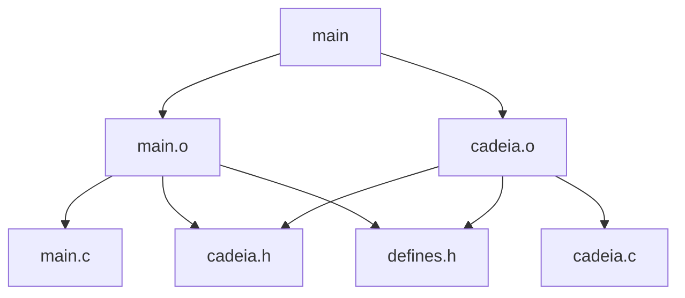

# Linhas para compilação e execução

## Compilação
```bash
make ALL
```

## Execução
```bash
./main
```
ou
```bash
./main exemplo.txt
```

# Grafo de dependências


```mermaid
graph TD
    main --> main.o
    main --> cadeia.o

    main.o --> main.c
    main.o --> cadeia.h
    main.o --> defines.h
    
    cadeia.o --> cadeia.h
    cadeia.o --> cadeia.c
    cadeia.o --> defines.h
```
