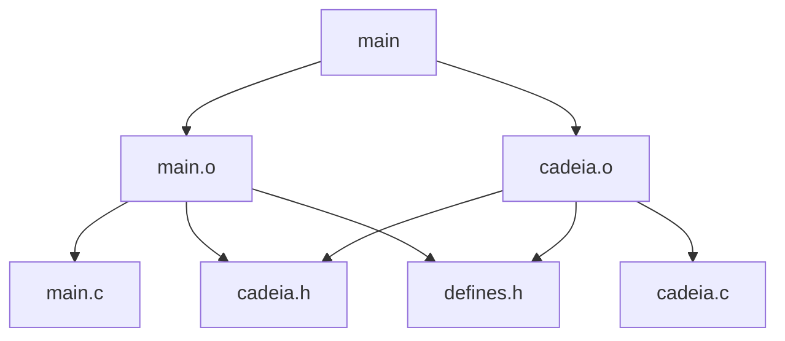

# Linhas para compilação e execução

## Compilação
```bash
make ALL
```
ou
```bash
mingw32-make ALL
```
(varia de acordo com a instalação local)

## Execução
```bash
./main
```
ou
```bash
./main exemplo.txt
```

# Grafo de dependências


