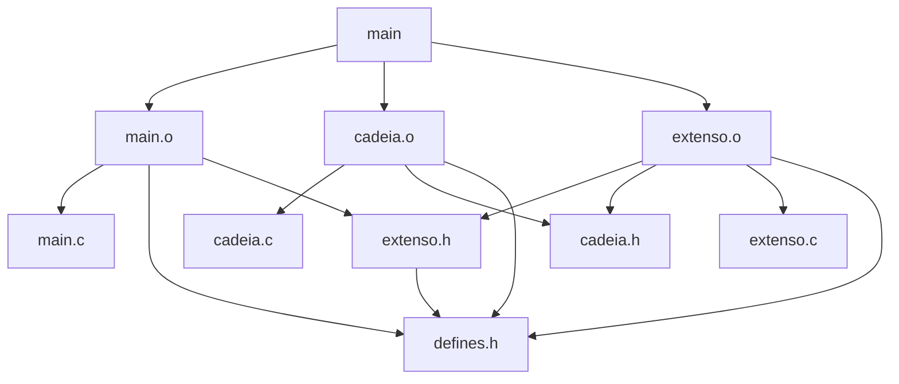

# Linhas para compilação e execução

## Compilação
```bash
make ALL
```
ou
```bash
mingw32-make ALL
```
(varia de acordo com a instalação local)

## Execução
```bash
./main
```
ou
```bash
./main exemplo.txt
```

## Limpar
usando rm
```bash
make clean
```
ou
usando del, geralmente Windows
```bash
mingw32-make clean_win
```
(a utilização de make ou mingw32-make depende da instalação local)

# Grafo de dependências


